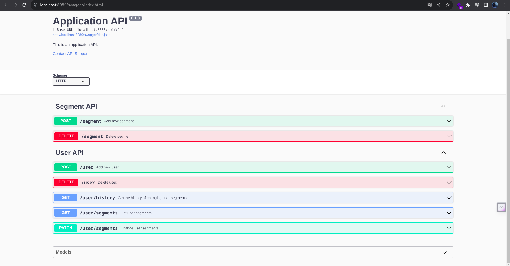
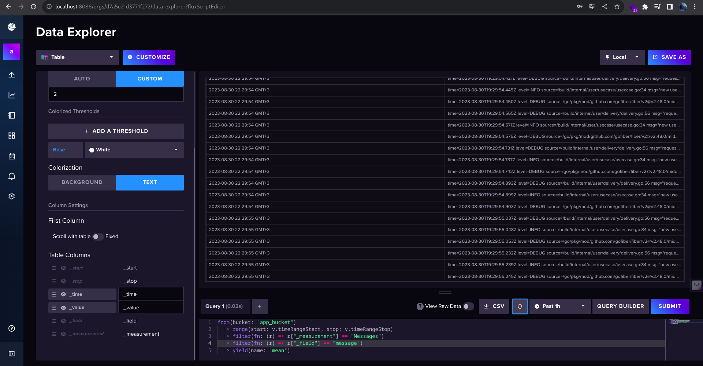

# backend-trainee-assignment-2023

## [Задание](task.md)
Все дополнительные задания были выполнены.

## Запуск и завершение
Для запуска приложения в корне проекта необходимо выполнить команду
```shell
make run
```

Для завершения работы в корне проекта необходимо выполнить команду
```shell
make shutdown
```

## Работа с API
Для приложения был разработан Swagger UI. 
После запуска приложения он становится доступен по ссылке http://localhost:8080/swagger/index.html.



Логи системы хранятся не в контейнерах, а в InfluxDB (http://localhost:8086/, app_bucket).


